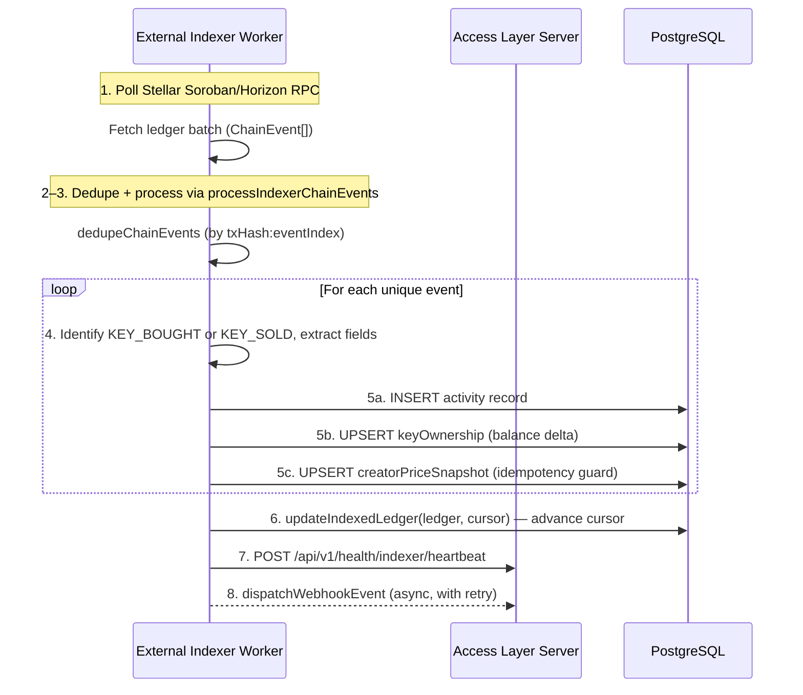

# Indexer Architecture

End-to-end architecture of the indexer pipeline: how on-chain Stellar events travel from the external polling worker through to all three database destinations on this server.

See also:
- [Indexer Contributor Expectations](./CONTRIBUTOR_EXPECTATIONS.md)
- [Chain Event Processing](./EVENT_PROCESSING.md) — deduplication and idempotency detail
- [Retry and Backoff](./RETRY_BACKOFF.md) — retry strategy and exhaustion behaviour
- [Dead-Letter Queue Workflow](./DLQ_WORKFLOW.md) — DLQ investigation runbook
- [Feature Flags](./FEATURE_FLAGS.md) — startup validation and flag reference

---

## Overview



---

## Polling loop and ledger batch fetch

The Stellar RPC polling loop runs in a **separate external worker** (not this server). Two env vars configure the RPC endpoints (`STELLAR_SOROBAN_RPC_URL`, `STELLAR_HORIZON_URL`) but they are not consumed by this server — they are for the external worker only.

The external worker delivers events to this server as `ChainEvent[]`, defined in `src/utils/indexer-dedupe.utils.ts`:

```typescript
interface ChainEvent {
  txHash: string;       // Transaction hash — unique across the chain
  eventIndex: number;   // Index of the event within the transaction
  ledger?: number;      // Optional ledger sequence number
  [key: string]: any;   // Additional event-specific fields
}
```

**Progress tracking** — this server maintains a single-row `IndexedLedger` table (`id = 1`) with fields `ledger`, `cursor`, and `updatedAt`. After a batch is fully written, the external worker calls `updateIndexedLedger(ledger, cursor)` in `src/modules/indexer/ledger-gap-detection.service.ts` to advance the opaque cursor.

**Gap detection** — `detectLedgerGap()` in the same file compares `IndexedLedger.ledger` against the Stellar network head and emits a structured `warn` log when the gap exceeds 10 ledgers (~50 seconds at 5 s/ledger). In development the network head is a mock value (`12_400`); a `// TODO: Replace with actual Stellar RPC call` comment marks where the real RPC call will go. Do not rely on this value in production until that TODO is resolved.

**Cursor staleness** — `checkIndexerCursorStalenessFromStore()` in `src/utils/indexer-cursor-staleness.utils.ts` reads `IndexedLedger.updatedAt` and emits a warn log when the lag exceeds `INDEXER_CURSOR_STALE_AGE_WARNING_MS` (default: 5 minutes). Controlled by the `ENABLE_INDEXER_CURSOR_STALENESS_WARNING` feature flag.

---

## Event parsing

Raw Stellar events are cast to `IndexerChainEvent` (defined in `src/utils/indexer-event-processor.utils.ts`), which extends `ChainEvent` with a typed `eventType` discriminator:

```typescript
interface IndexerChainEvent extends ChainEvent {
  eventType: string;  // e.g. 'KEY_BOUGHT', 'KEY_SOLD', 'CREATOR_REGISTERED'
}
```

Extraction of typed fields from raw Soroban contract data happens **in the external worker** before events reach this server. By the time events enter `processIndexerChainEvents`, they already carry the following fields:

| Field        | Type     | Description                                           |
| :----------- | :------- | :---------------------------------------------------- |
| `txHash`     | string   | Stable dedup key and log correlation ID prefix        |
| `eventIndex` | number   | Per-transaction index; combined with `txHash` for ID  |
| `ledger`     | number   | Stellar ledger sequence number                        |
| `eventType`  | string   | `KEY_BOUGHT` or `KEY_SOLD` for trade events           |
| `creatorId`  | string   | Which creator's key was traded                        |
| `actor`      | string   | Buyer or seller wallet address                        |
| `amount`     | number   | Number of keys traded                                 |
| `price`      | bigint   | Price in stroops                                      |
| `feePaid`    | bigint   | Protocol fees in stroops                              |
| `tradeAt`    | Date     | ISO timestamp of the transaction                      |

`processIndexerChainEvents(events, handler)` in `src/utils/indexer-event-processor.utils.ts` wraps the processing loop: it first calls `dedupeChainEvents` internally (removing duplicates by `txHash:eventIndex`), then runs the provided `handler` for each unique event. Each event emits exactly one structured `info` log (`type: 'indexer_event_processed'`) with `elapsedMs` measured from a monotonic clock.

---

## Write path

Each `KEY_BOUGHT` or `KEY_SOLD` event triggers three idempotent writes before the cursor is advanced.

### Activity feed

One record is inserted into the `activity` table per event:

```
{
  type:      'KEY_BOUGHT' | 'KEY_SOLD',
  creatorId: string,
  actor:     string,        // buyer or seller address
  payload: {
    amount:           number,
    price_at_trade:   bigint,  // stroops
    fee_paid:         bigint,  // stroops
    ledger_sequence:  number
  }
}
```

The read side is `fetchActivityFeed()` in `src/modules/activity/activity.service.ts`.

### Ownership read model

`updateOwnership(ownerAddress, creatorId, balanceChange)` in `src/modules/ownership/ownership.service.ts` keeps a per-holder key balance:

- Upserts `keyOwnership` keyed by the composite unique constraint `(ownerAddress, creatorId)`
- Balance delta: `+amount` on `KEY_BOUGHT`, `−amount` on `KEY_SOLD`
- Uses Prisma's `upsert` with `{ increment: balanceChange }` — idempotency is the caller's responsibility (each event must be processed exactly once)

### Price snapshot

`upsertPriceSnapshot({ creatorId, price, tradeAt })` in `src/modules/indexer/price-snapshot.service.ts` maintains the `creatorPriceSnapshot` read model:

- **Idempotency guard**: skips events where `tradeAt ≤ existing.lastTradeAt`
- **First trade**: creates the row with `currentPrice = price24hAgo = price`
- **Subsequent trades**: updates `currentPrice`; rotates `currentPrice → price24hAgo` only when the existing snapshot is more than 24 hours old

---

## Webhook dispatch

After writes succeed, `dispatchWebhookEvent(tradeEvent)` in `src/modules/webhooks/webhook.service.ts` delivers the trade event to all of the creator's registered callback URLs. Dispatch is asynchronous (fire-and-forget). Webhooks that exhaust retries are flagged `isFailing = true` and stop receiving events until re-enabled.

See [Trade Webhooks Reference](../webhooks.md) and [Retry and Backoff](./RETRY_BACKOFF.md) for delivery semantics.

---

## Reliability layers

Each concern has its own reference document — no duplication here:

- **Deduplication**: [EVENT_PROCESSING.md](./EVENT_PROCESSING.md)
- **Retry and backoff**: [RETRY_BACKOFF.md](./RETRY_BACKOFF.md)
- **Dead-letter queue**: [DLQ_WORKFLOW.md](./DLQ_WORKFLOW.md)
- **Feature flags and startup validation**: [FEATURE_FLAGS.md](./FEATURE_FLAGS.md)
- **Contributor invariants**: [CONTRIBUTOR_EXPECTATIONS.md](./CONTRIBUTOR_EXPECTATIONS.md)
